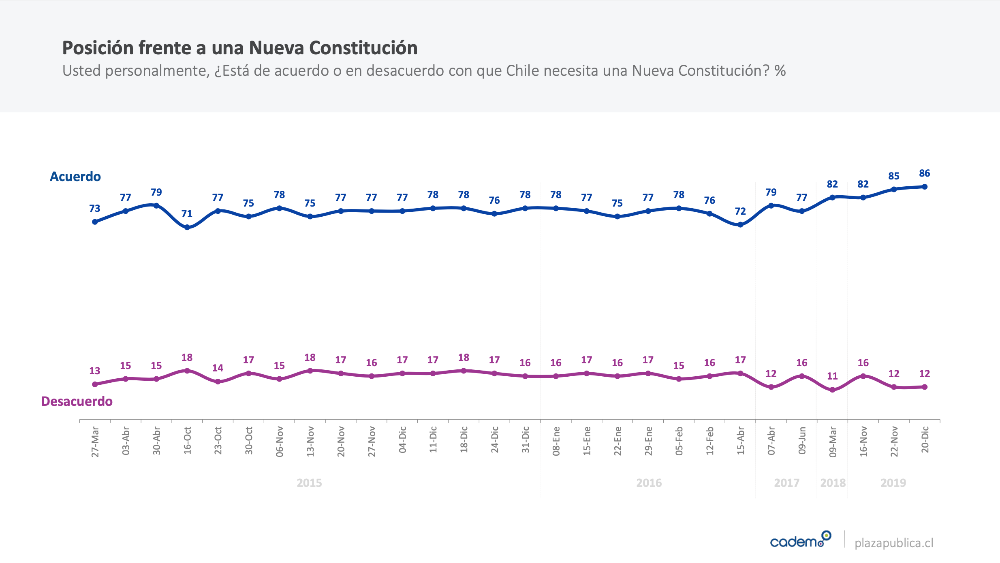

# ¿De qué hablamos cuando hablamos de un momento constituyente?

--

- Crisis institucionales

    - Post-revoluciones
    - Quiebres institucionales
    - Cambios drásticos (y violentos) de sistema o forma de gobierno

--

- Es una oportunidad en la que se plantea la posibilidad de establecer un nuevo pacto, un nuevo texto constitucional

???

Aquí la idea es definir el momento constituyente y por qué no ocurren en tiempos normales

Además agregaría lo de constituyente originario y derivado.

---

# ¿Cómo se puede escribir una Constitución?

--

- De varias maneras:

    - Parlamento o Congreso
    - Comisiones de expertos/as
    - Convenciones constituyentes
    - Asambleas Constituyentes
    - ...
    
--

Da lo mismo lo que digan los libros de texto de derecho constitucional, escribir una constitución es siempre un acto fundacional en el que no hay reglas predefinidas. 

Hay ejemplos, casos, experiencias, pero no reglas.

???

Enfatizar que no hay mecanismos fijos.

---

# Entonces, ¿por qué estamos en un momento constiutuyente?

--

## Propongo separar, analíticamente, dos preguntas:

1. ¿Por qué estamos en crisis?
2. ¿Por qué estamos conversando sobre escribir una nueva Constitución?

--

Sí, ambas están relacionadas, pero tienen distintos antecedentes y desarrollos.

???

Aquí quizás enfatizar que la respuesta constituyente, en mi opinión, es más consecuencia que causa. Al final, es algo de largo plazo

---

# Crisis

--

- Desigualdad (de ingreso, política, de servicios, etc.)

--

- ¿Modernización capitalista?

--

- ¿Crisis del modelo?

--

.center[Yo quiero proponer que hay, al menos, una dimensión de la desigualdad de la que se ha conversado poco: **Desigualdad de Poder**]

---

#Momento Constituyente

--

- La crisis social gatilló una respuesta constituyente, a contrapelo de las élites

--

- Pero el momento constituyente se venía gestando, al menos, desde el 2011. 

--

*Cadem 20 diciembre 2019*

---
class: middle, center, inverse

# Clave comparada

---
class: middle
# .center[Dos momentos a comparar]

1. Plebiscitos o referéndums
2. Redacción de la Constitución

---

# Plebiscitos

1. **Campañas políticas:** 

    - Regulación de métodos, gasto, mensajes. 
    - Legislación chilena se enfoca en gasto, transparencia y donaciones
    - No existe sanción legal (y quizás tampoco pública) a la transmisión de mentiras, información falsa, etc.
    - Uso de redes sociales es tierra de nadie

--

2. **¿Por qué necesitamos dos plebiscitos?**

    - Referéndums ratificatorios son la norma (ej. Bolivia, Colombia, Irlanda)
    - Pero, plebiscito de entrada es innovación chilena
    - ¿Está claro sobre qué votamos?
    - ¿A quién tenemos que convencer?
    - ¿Qué pasa si gana la opción 'rechazo'?
    - Brexit
    
???
 Brexit: Subir expectativas, la gente vota por cosas distintas y no por el fondo, congreso que no cumple promesas
 
---

# Redacción de la Constitución

- Asambleas o Convenciones constituyentes electas han ocurrido antes
- Sistemas de elección son relevantes:

    - Sistema especial, distinto de elección parlamentaria (ej. Sudáfrica, Bolivia)
    - Sorteos (ej. Irlanda)
    - Sistema basado en elección parlamentaria (Chile)

--

- Pero también lo son las reglas de toma de decisiones

    - Mayorías o quórums calificados
    - Tratados internacionales
    - Derechos de veto 
    
???

Explicar los sistemas

---
class:inverse, center, middle
# Y ahora, ¿qué?
